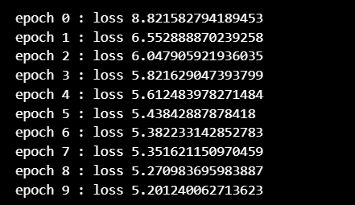
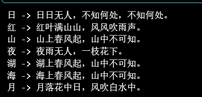
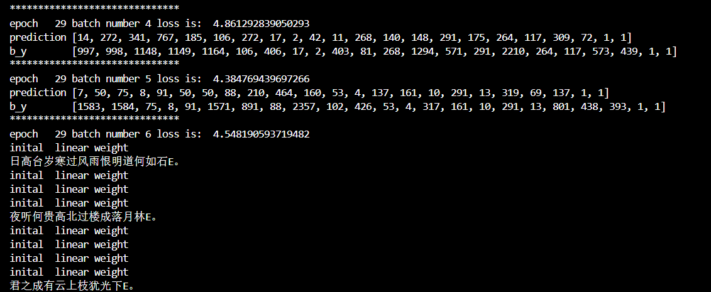

# 诗歌生成实验报告

## 一、实验内容

本次实验利用循环神经网络（RNN）构建中文诗歌生成模型，并且完成了TensorFlow和PyTorch两个版本，来对比不同框架实现的差异。

---

## 二、RNN、LSTM、GRU模型解释

### 2.1 RNN

RNN，循环神经网络，是一种专门处理序列数据的神经网络，通过循环结构使网络记住序列信息。其核心公式为：

$h_t = \tanh(W_{xh}x_t + W_{hh}h_{t-1} + b_h)$ 

$y_t = W_{hy}h_t + b_y$

其中 $h_t$ 是时刻 $t$ 的隐藏状态，$x_t$ 是输入，$y_t$ 是输出。RNN可以处理变长序列，但存在**梯度消失**和**梯度爆炸**问题，难以捕捉长距离依赖。

### 2.2 LSTM

LSTM,长短期记忆网络,通过引入门控机制（输入门、遗忘门、输出门）和状态 $c_t$ 来解决RNN的长期依赖问题。允许信息有选择地通过，有效缓解梯度消失，能够学习到更长的上下文依赖。

### 2.3 GRU

GRU，门控循环单元，是LSTM的变体，将遗忘门和输入门合并为“更新门”，并将细胞状态与隐藏状态合并。GRU参数量更少，计算效率更高。

本实验采用的是简单的 **SimpleRNNCell** 来进行建模。

## 三、诗歌生成过程（tf版）

诗歌生成过程主要分为四大部分，分别是：**数据预处理**、**搭建模型架构**、**训练模型**、**生成诗歌**。
### 3.1 数据预处理

- **读取文件**：从 `poems.txt` 读取每行格式为 `标题:诗歌内容` 的文本。（注意以utf-8的格式解码读取）
- **添加标记**：每首诗开头添加 `bos`（begin of sentence），结尾添加 `eos`（end of sentence）。
- **构建词汇表**：统计所有字符频次，加入 `PAD`（填充）和 `UNK`（未知）标记，按频次排序分配索引。
- **序列化**：将字符序列转换为索引序列，并记录每个样本的真实长度。
- **数据集封装**：使用 `tf.data.Dataset` 进行打乱、填充批处理，并构造输入（`x[:, :-1]`）和目标（`x[:, 1:]`）序列，用于自回归训练。

### 3.2 模型结构

源代码构建的模型结构如下：

1. **嵌入层**：将输入的token ID（整数）映射为64维向量。
2. **RNN层**：使用 `SimpleRNNCell` 包装为 `RNN` 层，输出所有时间步的隐藏状态（维度128）。
3. **全连接层**：将每个时间步的隐藏状态映射为词汇表大小的logits。

### 3.3 训练过程（tensorflow版）

- **损失函数**：使用 `sparse_softmax_cross_entropy_with_logits` 计算每个位置交叉熵，并通过自定义 `reduce_avg` 函数忽略填充位置的损失，最终取批内平均。
- **优化器**：Adam，学习率0.0005。
- **迭代**：训练10个epoch，每个epoch打印一次损失变化。

### 3.4 生成过程

生成时，使用训练好的模型进行逐词预测：

1. 输入 `bos` 标记，获得初始状态。
2. 输入指定的起始词（如“日”），得到下一个词的 logits，并取 `argmax` 作为输出。
3. 将输出词作为下一时刻输入，重复直至达到最大长度或生成 `eos`。

---

## 4. 具体任务完成截图

本实验要求生成以“ 日 、 红 、 山 、 夜 、 湖、 海 、 月 ” 等词汇作为begin word的诗歌。

训练tensorflow版的RNN的实验结果截图如下：

（具体可以见chap6_RNN\poem_generation_with_RNN-exercise.ipynb内容）

Pytorch版的RNN（LSTM，30个epoch）实验截图如下：（效果比tf更差一点）

